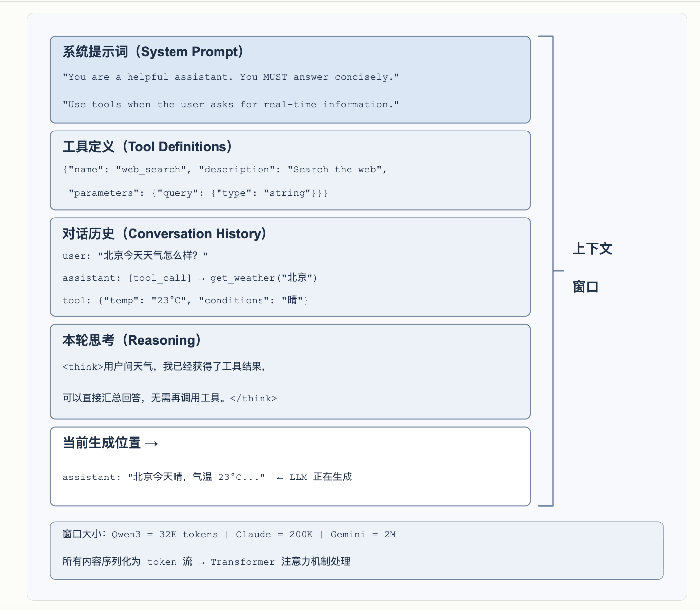
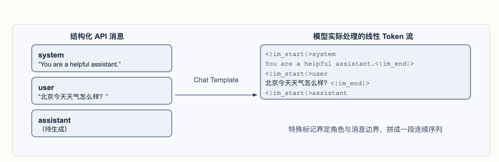
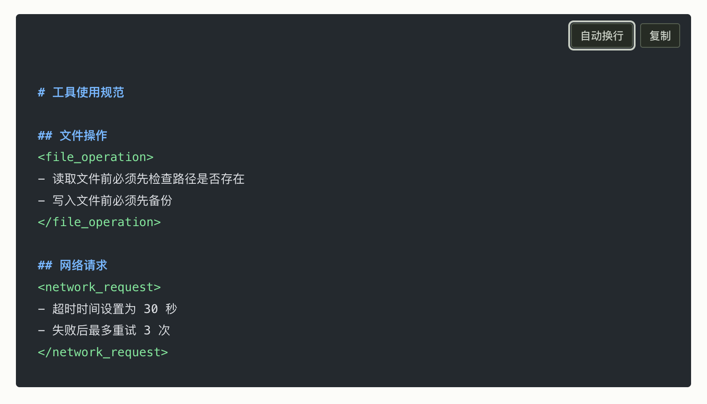

# https://bojieli.github.io/ai-agent-book/astro/#contents

## 入门

### harness的补丁部分随着模型变强自己内化
- 例如"一步步思考"等的技巧。

### 编排模式
- 要保持简单。
- **workflow模式**
  - 确定性的编排。
  - 预定义的路径编排LLM和工具系统。节点之间的流转顺序是固定的。
  - scott类似就是这种模式，但是被emux平台给绑定了。
  - 以一个订机票 Agent 为例，工作流可以设计为四个固定节点： 
    - 核实用户身份——调用身份验证 API，确认用户是谁 
    - 搜索可用航班——根据用户需求查询航班数据库 
    - 完成付款——调用支付接口扣款 
    - 确认预订——调用预订 API 锁定座位，向用户发送确认信息
  - pros.
    - 严格的流程控制。
    - 安全性。
  - cons.
    - 缺乏变通。
- **自主模式**
  - 当工作流的固定路径无法满足需求时，我们就需要自主Agent(Autonomous Agent)。
  - 自主Agent与工作流的核心区别在于：执行路径不是预先定义的，而是Agent根据环境反馈实时决定的。
  - 以订机票为例：自主 Agent 不需要预定义四个固定节点。用户说“帮我订下周三去上海的机票”，Agent 会自行决定先搜索航班、发现需要登录、于是先核实身份、再回来搜索、发现最便宜的航班需要转机、主动询问用户是否接受、用户说不要转机、Agent 调整搜索条件...
  - 自主Agent特别适用于开放式的问题——这类问题难以预测所需的步骤数量。
- **两种模式的选择与混合**
  - 很多系统会混合使用两种模式：关键的、有严格合规要求的流程用工作流来确保可靠性，需要灵活决策的部分切换到自主模式。

### 通用设计模式
- proposer-reviewer 
  - GAN的方式。**两个不共享上下文的角色承担。**
- Progressive Disclosure
  - 渐进式披露。不把全部信息一次性放进上下文，而是先给一份可检索的目录，再按需加载细节。
  - 它同时优化两件事 - 上下文预算与选择精度。
- Append-only
  - 状态以追加的方式演进，已经写下的内容不再回头修改。换来的是可缓存、可重放、可审计。
- Boundary Set + Retention Set
  - 边界集 + 保留集。任何一次修改都要同时在”它应当改变的那批样本”和”它不应当影响的那批样本”上验证。
  - 类似搜索系统的top + random的回归测试。
- 最小 diff + 可回滚
  - 每次修改尽量小、带来源、可单独回滚，而不是整体重写。它让归因成为可能——出了问题能定位到具体哪一次改动。

### 总结
- Agent = 大脑+眼睛+手脚。LLM 是大脑（决策核心），上下文是眼睛（决定它能看到什么），工具是手脚（决定它能做什么）。三者缺一不可。
- 扩展眼睛和手脚是最主要的能力杠杆。**在模型固定时，重新定义或扩展观察空间与动作空间——也就是扩展上下文和工具，往往能直接把原本不可解的任务变为可解。**
- 眼睛（上下文）是决定性的因素：上下文由静态前缀（系统提示词 + 工具定义）和动态轨迹（消息历史）构成。消融实验表明，各组件并不等价：去掉工具定义或工具执行结果会直接夺走行动与闭环能力，去掉另外两者的代价则取决于信息能否从当前观测重建。ReAct 循环的本质是通过不断追加轨迹来让模型持续推进任务。
- Harness 是竞争力所在：模型能力正在商品化，真正的差异在于Harness。围绕上下文和工具构建的约束、验证与纠正机制，确保Agent“可靠地做事”。在生产级的Agent系统中，Harness的绝大部分代码都在实现这些保障机制，而不仅仅是上下文和工具本身。
- 从工作流到自主Agent：先优化提示词，再考虑工作流，最后才引入自主Agent。这是降低意外风险最实用的顺序。

## 上下文工程
- Agent只能基于它看到的信息做决策。上下文的设计和管理称为上下文工程（Context Engineering）。
- 所谓上下文，就是每次你和AI对话时，AI实际“看到”的全部信息。它不仅包含你们之前聊了什么（对话历史），还包含开发者预先写好的行为规则（系统指令）、AI可以使用的外部功能说明（工具描述）等各类信息。
- )
- **上下文的质量才是Agent能力的真正关键。一个中等能力的模型配上精心组织的上下文，往往能胜过一个顶级模型在信息匮乏下的盲目摸索。**
- 大多数团队的关键知识都是隐性的：架构决策只有老员工记得，业务规则靠口口相传，重要的背景信息锁在私聊记录里。如果团队本身就是一个信息黑洞，再好的AI Agent也无计可施。
- 对远程工作友好的团队往往也对AI Agent友好。对AI友好的环境：信息是公开的、可检索的、结构化的。

### 理解LLM API
- 大模型API最基本的交互模式——每次调用都是无状态的，所有模型需要的信息必须在请求的消息列表中完整提供。
- 模型只是发出了调用请求，**真正执行工具的是Agent框架**。这是理解Agent架构的关键：模型负责决策（调用什么工具、传什么参数），Agent 框架负责执行（实际调用 API、运行代码）。
  - mcp tool也是tool的一种。
- Agent框架的核心工作就是**管理messages列表**。在合适的时机往里追加消息，然后把整个列表送给模型。本章后续所有的上下文工程技术，本质上都是在优化这个列表的内容和结构。
- 不同的API格式稍微有一些不同，理解格式才知道怎么编程处理。
- 并行工具调用。在一次输出中同时生成了两个工具调用请求。Agent 框架检测到这一点后可以并行执行两个工具，实现流水线式的加速。
- 模型的终止判断。当 Agent 框架将工具结果送回后，模型会判断是否已有足够信息回答用户。如果够了，直接输出最终回复（不含工具调用）；如果不够，继续输出新的工具调用请求，触发下一轮ReAct循环。

### KV Cache 友好的上下文设计
- 模型每生成一个 token，都要回头看一遍前文所有 token 的中间计算结果。如果每轮都从头算一次，开销会随上下文长度爆炸式增长。
- KV Cache的做法是：把前文的中间计算结果缓存下来，下一轮只需要计算新增token的部分。**前提是要复用的上下文token前缀保持不变。**
- 若token序列从某个位置开始不同，首个不同token及其后的KV状态需要重新计算；此前位置的KV状态不受这次改动影响。
- 好的实践
  - 系统提示词和工具定义一旦确定就不要动态更改。
  - 动态信息永远追加到末尾——时间戳、用户状态等变化的内容，作为新消息追加到对话末尾，而不是修改已有的系统提示词。
  - 使用标准 API 格式，不要自行拼接消息。

### 从 API 消息到模型 Token：Chat Template
- 
- 常见的几种错误上下文管理方式
  - 动态系统提示词是最常见的错误。
  - 动态用户配置模式试图在每次请求中更新用户的状态信息（如剩余的 API 调用次数或账户余额）。更好的方案是在需要时通过专门的状态管理机制来处理。
  - 工具定义的动态排序是另一个隐蔽的陷阱。
  - 滑动窗口（Sliding Window）对话历史通过只保留最近几条消息来控制上下文长度。
    - 这种做法存在两个严重的问题。第一，它会破坏上下文的前缀一致性，导致 KV Cache 失效。第二，它可能丢失关键的工具调用结果。
    - 那怎么丢弃消息？
  - 文本格式化方法是最具破坏性的模式之一。
    - 它把结构化的role-content消息转换为"USER:.. ASSISTANT:.." 
    - 这样的纯文本流偏离了模型训练时使用的标准消息格式。
    - 模型在训练阶段接受了大量基于角色的对话数据，已经学会解析这种结构化格式；
    - 当消息被转为纯文本时，它需要额外消耗注意力去推断角色边界和对话结构，于是各种问题接踵而至：重复执行已完成的操作、忽略工具调用结果、在应该调用工具时却生成文本响应、格式解析错误。

### KV Cache 与 Prompt Cache：两个层级的缓存
- KV Cache是模型内部的机制——在一次推理过程中，缓存已计算的token的键值对，避免重复计算。
- Prompt Cache则是推理引擎的优化——在多次 API 请求之间缓存相同前缀的计算结果。
- 两者的优化原理相似（都利用前缀不变性），但作用层级不同：KV Cache加速单次请求内的token生成，Prompt Cache减少跨请求的重复计算成本。

### 系统提示词设计

#### 语气与风格：系统提示词的“人格”
- **You MUST answer concisely with fewer than 4 lines**
- **keep your response to 1-2 sentences**
- 过度使用会导致效果被稀释，应保留给真正关键的约束。

#### 结构化提示：系统提示词的“格式”
- 现代大语言模型对结构化输入展现出显著的敏感性，这源于训练数据中包含大量的结构化内容。
- 

#### 业务规则细化：系统提示词的“内容”
- 构建生产级的 Agent 系统时，最容易被忽视却最为关键的环节是业务规则的细化。这不是技术问题，而是产品设计问题，需要产品经理的深度参与。
- 模糊的规则（“根据任务情况选择合适的计费类型”）会导致 Agent 的行为极不稳定。
- 在优秀的 Agent 公司里，提示词一般由产品经理来设计。

#### Few-shot 示例：何时给模型看例子
- 当期望的输出难以用规则精确描述时——比如特定风格的文案、结构化报告的格式、客服回复的语气分寸——与其堆砌冗长的文字定义，不如直接给出两三个高质量的输入-输出示例。
  - 效果往往胜过等量篇幅的抽象规则。
- 对于模型本来就擅长、规则又容易说清的任务，示例只是浪费 token。

#### 工具定义的设计
- 从 Claude Code 的工具定义中可以观察到，每个工具描述都精心设计了
  - 使用边界（“NEVER invoke grep or rg as a Bash command”）
  - 具体示例（timezone: 'America/New_York'）
  - 性能提示（“Batch your tool calls together”）
  - 工具间的协作关系（“Use the Read tool at least once before editing”）
- 2026 年以来，工具定义本身也在向本章 Skills 式的“渐进式披露”演进，且已经是 API 层的原生能力而非框架补丁。
  - Claude Code 对 MCP 工具默认延迟加载——会话启动时只注入工具名称和服务器说明，完整 schema 待模型搜索到之后才注入。
  - Codex CLI 的 tool_search（BM25 检索）则不是可选特性，而是默认开启的架构。
- 消融实验方法
  - **消融实验方法（逐个移除系统组件来研究其作用）。核心是控制变量法：设定一个基线配置（结构化系统提示词、完整工具描述、专业中立语气），然后系统地修改不同方面，观察对任务完成率、交互效率和用户满意度的影响。**
  - 维度一：语气与风格——我们实现了三种截然不同的风格。
    - 默认保持专业中立的商务语气；Trump 风格使用夸张修辞和极度自信的表达（“我会给你订到史上最棒的航班，没人比我更会订票”）；Casual 风格则采用轻松的口吻和大量表情符号。虽然风格显著改变了表达方式，但对任务完成率的影响相对有限，说明模型具有强大的风格适应能力。
  - 维度二：信息组织——保留所有规则的内容但打乱组织结构，去除标题层次，把有序的流程拆散成无序的规则集合。
    - 这个看似简单的改变带来了灾难性的后果：任务成功率下降超过 30%，Agent 经常违反关键的业务规则。当规则以无序的方式呈现时，模型难以识别其中的优先级和依赖关系——例如“先验证身份再处理退款”这条规则被拆散后，Agent 有时就会跳过身份验证直接执行退款。这印证了一个原则：对人类友好的信息组织方式，对模型同样友好。
  - 维度三：工具描述——保留函数签名和参数定义，但移除所有描述性文本。
    - 结果，工具调用的错误率增加了 45%，Agent 频繁传入无效的参数值或误解参数的含义。

### Skills：领域能力的可组合单元
- Agent Skills的核心思想是将Agent的能力模块化为独立的、可按需加载的知识包。
- 每个Skill本质上是一套包含专业领域指导的提示词集合。
- 每个Skill必须包含一个SKILL.md文件，开头是YAML frontmatter（即文件顶部用 --- 分隔的元数据块，类似书籍的版权页），包含name和description两个字段。
  - 元数据中的description字段是路由决策的关键——它应当足够短（控制常驻的 token 量），但写法要像路由条件而非功能介绍。
  - 明确写出“何时使用”和“何时不使用”的边界，并给出几条典型反例，以减少宽泛匹配带来的误触发。
- Skills的价值不仅在于优雅的上下文管理，更在于为领域知识的积累提供了一条可持续的路径。每个Skill都是自包含的知识模块，可以独立开发和测试，也可以单独进行版本控制，便于分享。

### Agent状态栏：通过元信息增强Agent轨迹管理
- 这个内容我认识不足。
- 如何让 Agent 随时看到任务进度、环境变化和工具调用计数等运行时状态。
- 提示工程给的是静态指令，而Agent在执行过程中还需要动态感知自身状态与任务进展。Agent框架把这些动态信息整理成结构化摘要并注入上下文，这种机制称为Agent状态栏（Agent Status Bar）。
- Agent 状态栏之所以有效，源于注意力机制的一个本质特性：上下文学习更像检索而非推理——模型擅长从已有内容中查找信息，但不擅长主动归纳和总结。
- 这种机制的本质是把分散在上下文各处的隐式状态提炼为可直接使用的显式知识。

#### Agent状态栏的构成
- 任务规划：当Agent处理复杂的多步骤任务时，轨迹会变得很长。容易过分关注当前的局部子任务，而忘记用户的原始诉求、核心约束以及后续工作。引入TODO列表，将任务分解为清晰的步骤，再把列表放在轨迹末尾，不断提醒模型当前的进展和后续目标，确保行动与总体规划保持一致。
- 环境当前状态的观察摘要：包括动态的环境信息（系统时间、工作目录等）、异常操作提醒（“该工具已被重复调用 N 次”）、以及从隐式状态到显式观察的转换。

#### Agent状态栏在上下文中的具体位置
- 一个重要的实现细节是：Agent状态栏在API层面实际上是作为一条user角色的消息插入到上下文末尾的——而不是修改开头的system消息。
- Harness是在借用user角色这个消息槽位，向模型注入由Agent框架自动生成的系统状态信息——内容并非来自真实用户，只是复用了user角色的消息格式来挂到上下文末尾。

#### Agent的状态更新的两种实现与缓存代价
- 状态变化后的更新。
  - 实现一：每轮替换。每次API调用前，从消息列表中移除上一轮的状态消息，在末尾追加最新状态。
    - 这保证了上下文中只有一份状态、永远是最新的。
    - 代价是移除旧状态会使其位置之后的所有缓存失效
  - 实现二：持久追加。状态消息一旦注入就永久留在轨迹中，每轮只在末尾追加新的状态。
    - Claude Code的<system-reminder>采用的就是这种方式——历史状态消息保留在会话记录（transcript）中，从不删改。
    - 这种方式对缓存完全友好：所有消息只追加、不修改，前缀始终稳定。
    - 代价是陈旧的状态会在上下文中累积，既占用token，也要求模型自己关注 “最新一条” 状态而忽略已过时的旧状态。

#### 状态栏的维护
- 状态栏尽量用代码维护。

### 上下文压缩
- 随着多轮交互的深入，上下文会不断膨胀。本节讨论的是相反的方向：如何为上下文做减法——什么时候压缩、怎么压缩、为什么即使上下文没满也应该压缩。

#### 为什么需要压缩：不只是长度问题
- 第一，解决长度约束和成本约束。这是最直观的原因：上下文窗口有限，工具调用结果动辄数万字符，几轮交互就可能撑满窗口，任务被迫中断。同时token越多，API成本越高，推理延迟也会急剧上升。
- 第二，提升思考质量——总结后的知识比原始形式更利于模型使用。
- 第三，缓解模型的上下文焦虑（Context Anxiety）。当模型认为上下文窗口即将耗尽时，可能在任务尚未完成前提前收尾。

#### 上下文学习的内部机制：检索而非推理
- 注意力机制擅长在已有内容里 “查找”，却不擅长在一次前向传播里主动 “归纳统计”。
- **把需要思考才能得到的结论，变成可以直接检索的知识。**
- 长上下文会导致检索精度的下降。明明上下文窗口还远没有满，但Agent突然找不到关键信息了，或者反复纠结于一个早已解决的问题，这种现象被称为上下文腐化（Context Rot）
- 上下文压缩的设计原则：与其期望模型从冗长的上下文中自动学习，不如主动地、显式地进行知识提炼。
  - 虽然需要额外的计算投入（用专门的 LLM 调用来做总结），但产生的是经过压缩的高密度知识表示——不要让模型被动地在海量信息中检索，而要主动为模型提供经过提炼的结构化知识。

#### 压缩与 KV Cache：看似矛盾，实则互补
- 前面反复强调 KV Cache 要求上下文前缀保持不变，但压缩不就是要修改上下文中间的内容吗？
- 键在于理解压缩发生的时机和位置。
  - 压缩不是在单次 API 调用的过程中修改上下文，而是在两次 API 调用之间。
  - System Prompt和Tool Definitions永远不动。
  - 压缩的对象是对话历史中的 tool results。当Agent框架用压缩后的摘要替换原始的工具输出时，替换位置之后的缓存会失效，但之前的缓存仍然有效。
  - 这是一个有意识的权衡：不压缩，上下文膨胀到超出窗口限制，任务直接失败；压缩后，虽然损失了部分缓存，但上下文长度可控且信息密度更高。因此压缩的频次需要权衡——频繁压缩会频繁破坏缓存。

#### 生产级的压缩策略
- https://rayliu419.github.io/learn-claude-code/notes/context-compaction-study.html

#### 隔离替代压缩
- 压缩是在信息已经进入上下文之后做减法，而一个更釜底抽薪的思路是：让大体积的中间信息根本不进入主上下文。
- 子Agent上下文隔离——主Agent把 “在代码库中大范围搜索” 这类会产生海量中间内容的任务，委派给一个独立的子 Agent。
- 用隔离代替压缩：压缩是有损的、需要额外 LLM 调用的事后补救；隔离则让噪声从一开始就与主上下文绝缘，主 Agent 的 KV Cache 前缀也完全不受影响。代价是子 Agent 看不到主 Agent 的完整上下文，任务描述必须自包含、目标明确。

