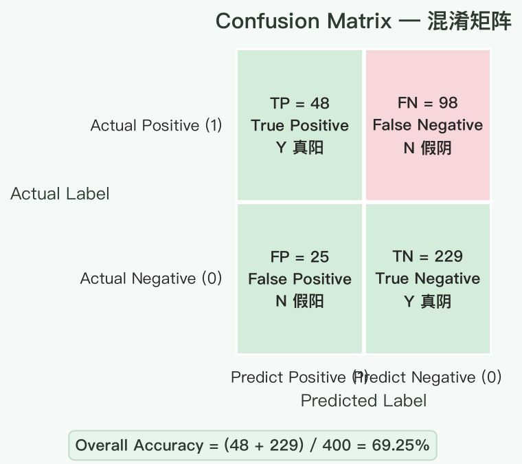
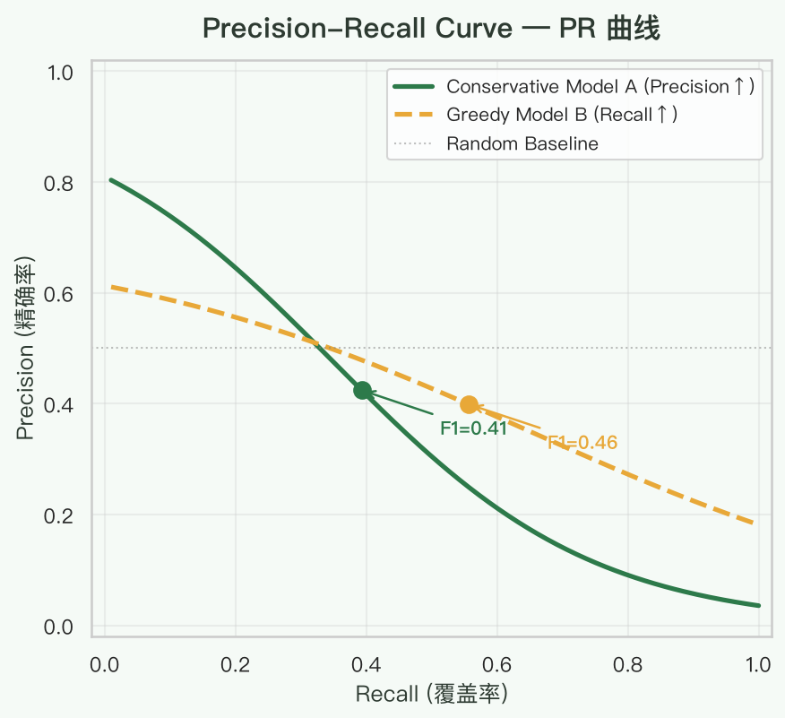
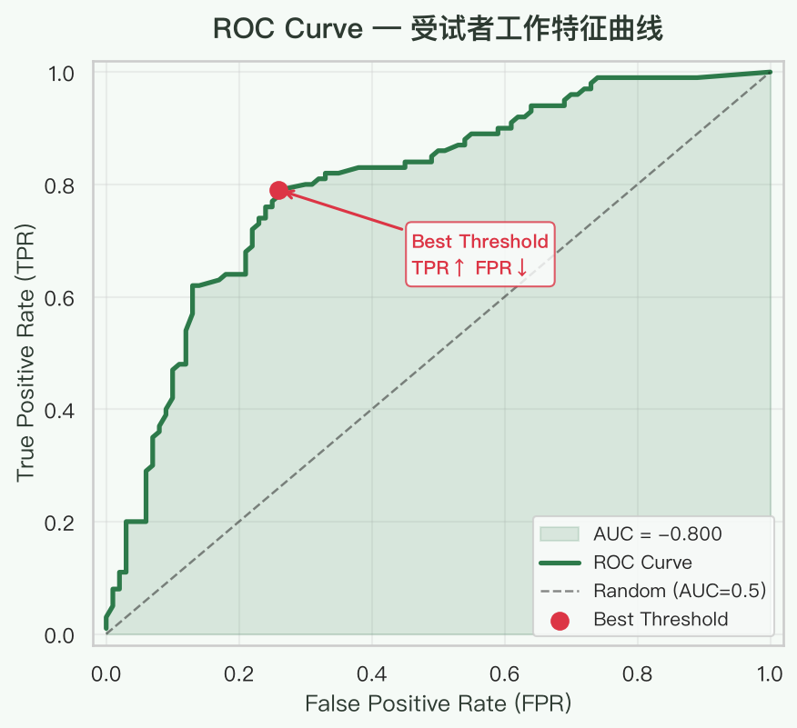
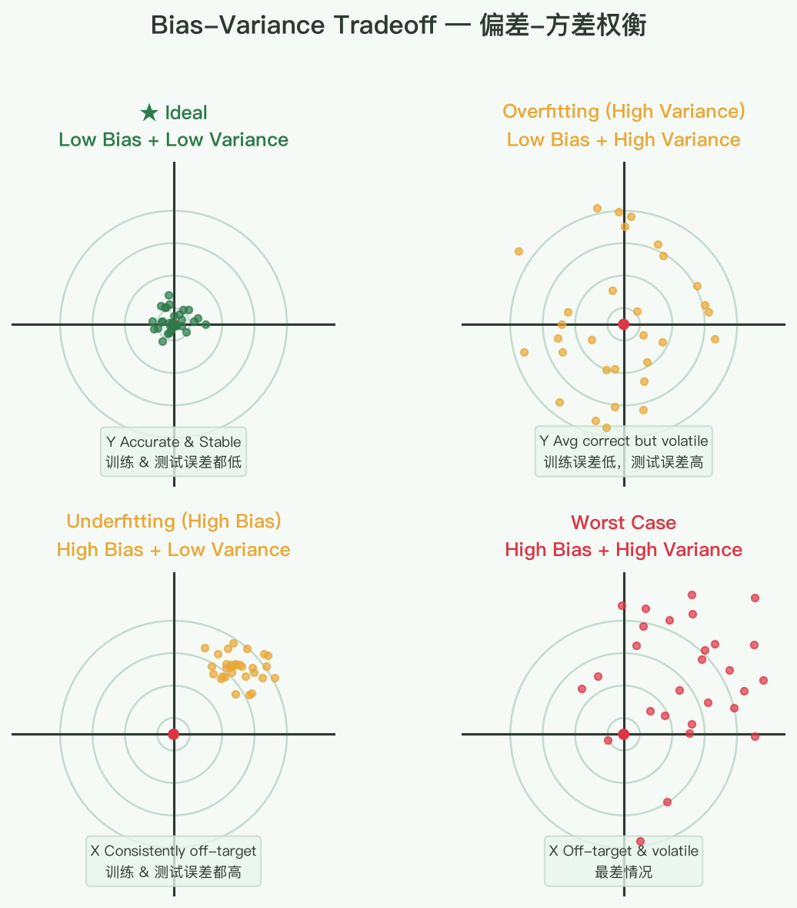
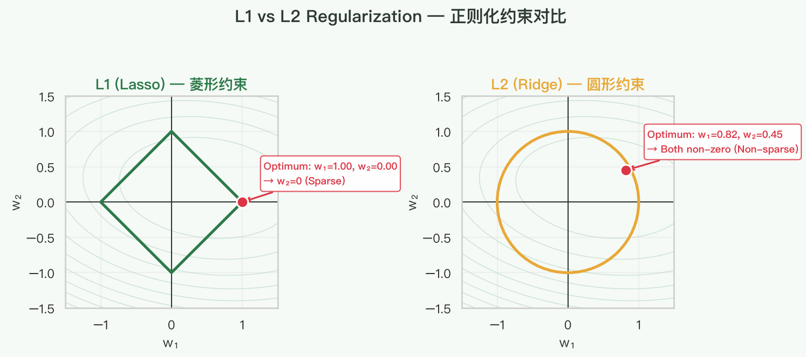
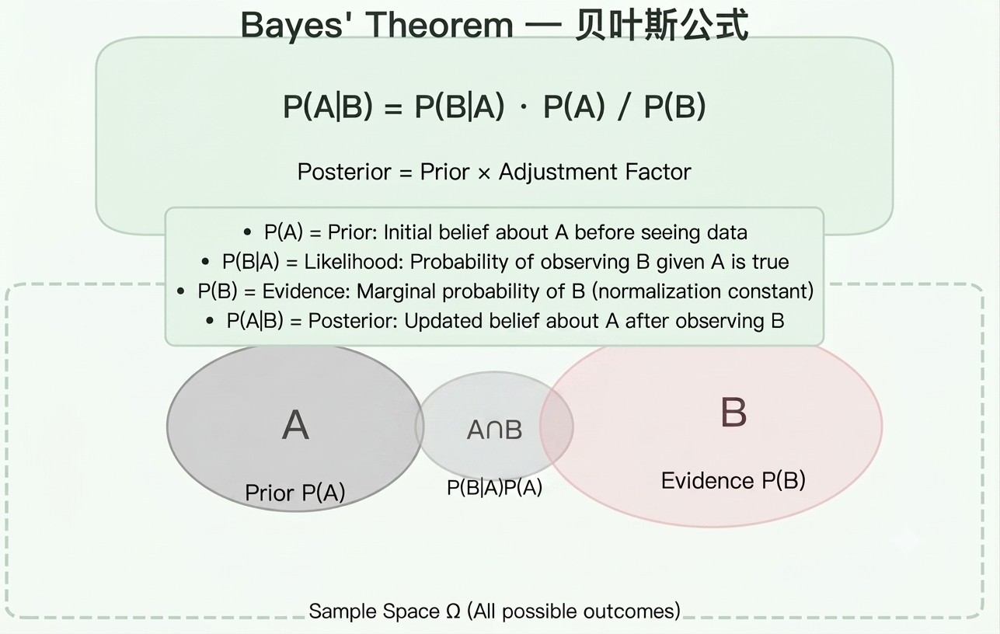
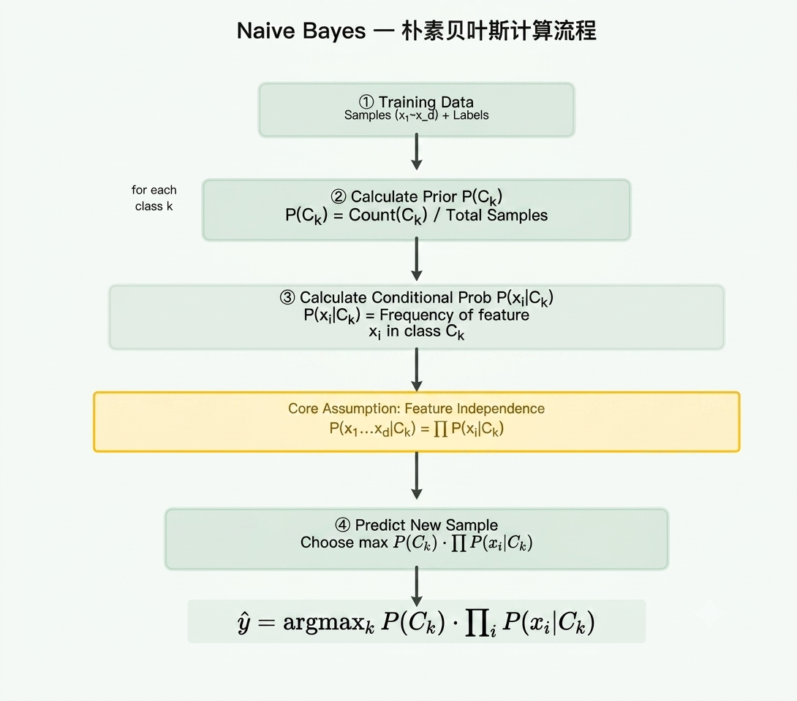

# ML Basis — 机器学习基础笔记

> 机器学习核心概念速查，覆盖评估指标、模型调优、经典算法、常见问题与应对策略。

---

## 回归问题评估

| 指标  | 公式                                    | 说明                                   | 单位敏感 |
|-------|-----------------------------------------|----------------------------------------|----------|
| **MAE** | $\frac{1}{n}\sum_{i=1}^n \|y_i - \hat{y}_i\|$ | 平均绝对误差，直观，对异常值不敏感      | 是       |
| **MSE** | $\frac{1}{n}\sum_{i=1}^n (y_i - \hat{y}_i)^2$ | 均方误差，放大较大误差，对异常值敏感    | 是       |
| **RMSE** | $\sqrt{MSE}$                          | MSE 开根，量纲与原始数据一致            | 是       |
| **MAPE** | $\frac{100\%}{n}\sum_{i=1}^n \frac{\|y_i - \hat{y}_i\|}{\|y_i\|}$ | 平均绝对百分比误差，无量纲，便于跨问题比较 | 否    |
| **R²** | $1 - \frac{\sum (y_i - \hat{y}_i)^2}{\sum (y_i - \bar{y})^2}$ | 决定系数，模型解释了多少方差，越接近 1 越好 | 否    |

**选用建议：**
- MAE 和 RMSE 反映不同侧重点——MAE 对每个误差一视同仁，RMSE 惩罚大误差。
- 有异常值时优先 MAE 或 Huber Loss；平滑优化时 MSE 可微更方便。
- R² 可辅助判断模型拟合程度，但单独使用容易过拟合。

---

## 分类问题评估

### 混淆矩阵

```
                Predict 1    Predict 0
Actual 1        TP (真阳)      FN (假阴)
Actual 0        FP (假阳)      TN (真阴)
```



**怎么记忆 True/False + Positive/Negative？**

1. 分类器**分类正确**的为 **True**，否则 **False**。
2. 分类器**分为 1** 的为 **Positive**，否则 **Negative**。

示例数字（手写数字识别，1 为正例）：

```
           Predict 1    Predict 0
Actual 1      48           98
Actual 0      25          229
```

- TP = 48（正确识别为 1）
- FN = 98（实际是 1 但被漏掉）
- FP = 25（误把 0 识别成 1）
- TN = 229（正确识别为 0）

---

### 召回率（Recall）和精确率（Precision）

> 一般来说，更关注**正例**的召回率和精确率。

定义：

| 指标             | 公式                  | 含义                                 | 示例值    |
|------------------|-----------------------|--------------------------------------|-----------|
| Accuracy         | (TP+TN) / 总数        | 整体正确率                           | 69.25%    |
| Error Rate       | (FP+FN) / 总数        | 整体错误率，= 1 - Accuracy           | 30.75%    |
| **Recall (TPR)** | TP / (TP+FN)          | 正例被正确找出的比例（覆盖率）       | 32.88%    |
| **Precision**    | TP / (TP+FP)          | 预测为正例中真正是正例的比例（可信度）| 65.75%    |
| Specificity (TNR)| TN / (TN+FP)          | 负例被正确识别的比例                 | 90.16%    |

**直觉理解：**
- **贪婪模型**：想覆盖更多正例 → 门槛低 → **Recall 高，Precision 低**。
- **保守模型**：只对很确信的样本预测 → 门槛高 → **Precision 高，Recall 低**。

---

### F1 Score

$$
F1 = \frac{2 \cdot Precision \cdot Recall}{Precision + Recall}
$$

- Precision 和 Recall 的**调和平均数**。
- 两个模型一个 Pre 极高 / Rec 极低，另一个 Rec 极高 / Pre 极低时，F1 可能相近，需结合场景判断。



**Fβ Score（加权 F 值）：**

$$
F_\beta = (1 + \beta^2) \cdot \frac{Precision \cdot Recall}{\beta^2 \cdot Precision + Recall}
$$

- $\beta < 1$：更重视 Precision。
- $\beta > 1$：更重视 Recall。

---

### ROC 与 AUC

**核心思想：** 遍历所有阈值，对每个阈值计算两个指标：
- **TPR（真正率）** = Recall = TP / (TP + FN)
- **FPR（假正率）** = FP / (FP + TN)

这两个值基于**混淆矩阵的行**来算，所以**不受数据分布（正负例比例）影响**。



**AUC 含义：**
- AUC = 1 → 完美分类器。
- AUC = 0.5 → 随机猜测。
- AUC 回答的问题：**"不论数据分布怎么样，模型 in general 能表现得多好？"**

**最佳阈值选择：** TPR 高，FPR 低——即左上角 (0,1) 最近的点。

**ROC vs PR 曲线：**
| 特性           | ROC                           | PR Curve                     |
|----------------|-------------------------------|------------------------------|
| 受数据分布影响 | 小（TPR/FPR 分属行列，独立）  | 大（Precision 依赖先验分布） |
| 适合场景       | 各类分布比较均衡时            | **正负例高度不平衡时更敏感** |

---

## Bias 和 Variance

**偏差-方差权衡：**

```
欠拟合 ←———→ 过拟合
High Bias     High Variance
```

- **High Bias（欠拟合）**：模型过于简单 / 数据太少 → 预测值偏离真实值，训练误差和测试误差都高。
- **High Variance（过拟合）**：模型过于复杂 → 过度学习了训练数据的噪声，训练误差低但测试误差高。



**应对策略：**
| 问题         | 症状                     | 解决方向                     |
|--------------|--------------------------|------------------------------|
| High Bias    | 训练误差高                | 增加模型复杂度、更多特征、减少正则化 |
| High Variance| 训练误差低，测试误差高    | 简化模型、更多数据、增加正则化、早停 |

---

## L1 正则化 / L2 正则化

### 数学形式

线性回归损失函数加入正则项：

- **L1 (Lasso)**：$\text{Loss} = \text{MSE} + \lambda \sum_{j=1}^p |w_j|$
- **L2 (Ridge)**：$\text{Loss} = \text{MSE} + \lambda \sum_{j=1}^p w_j^2$

### 为什么 L1 产生稀疏解？

L1 约束的解空间是**菱形**（与坐标轴相交），最优点容易落在坐标轴上，对应系数为 0。L2 约束的解空间是**圆形**，难以恰好落在轴上。



### 实际选择

| 正则化 | 特点                         | 适合场景                     |
|--------|------------------------------|------------------------------|
| L1     | 自动特征选择，产生稀疏解     | 高维数据，特征数量 >> 样本量 |
| L2     | 数值稳定，**实际效果通常更好** | 大多数通用场景               |
| **ElasticNet** | L1 + L2 混合          | 特征有关联时效果更好         |

---

## 决策树剪枝

### 预剪枝（Pre-pruning）
- **时机**：在决策树生成过程中剪枝。
- **做法**：提前停止分裂——设置最大深度、最小样本数、最小信息增益等。
- **优点**：效率高，避免生成复杂子树。
- **缺点**：可能欠拟合（过早停止错过好分裂）。

### 后剪枝（Post-pruning）
- **时机**：决策树完全生长之后再剪枝。
- **做法**：合并父节点下子节点，如果**熵增加不大**则合并。
- **常见方法**：错误率降低剪枝（REP）、代价复杂度剪枝（CCP）。
- **优点**：效果通常比预剪枝好。
- **缺点**：计算开销大。

---

## 样本不平衡

| 方法                       | 说明                                                                 |
|----------------------------|----------------------------------------------------------------------|
| 1. 收集更多数据            | 最直接的方法，但有时不可行                                           |
| 2. 下采样（Undersampling） | 减少多数类样本，可能丢失重要信息                                     |
| 3. **SMOTE**               | 人工合成少数类新样本（在特征空间插值）                               |
| 4. 加权损失函数            | 对少数类误判给予更高的惩罚权重                                       |
| 5. 采用不敏感的模型        | 树模型（RF/GBDT）对不平衡相对鲁棒                                    |
| 6. 集成方法                | Balanced Random Forest, EasyEnsemble 等                              |
| 7. 调整阈值                | 根据业务需求调整分类阈值（从默认 0.5 改为更低或更高）               |

> **关键原则**：在不平衡场景下，不要只看 Accuracy——关注 Precision、Recall、F1、AUC。

---

## 过拟合

### 原因
- 模型过于复杂（参数太多）
- 训练数据太少或噪声太大
- 训练时间太长（迭代过多）

### 应对策略

| 策略             | 具体做法                                           |
|------------------|----------------------------------------------------|
| 1. 更多数据      | 数据增强、收集更多真实样本                         |
| 2. 简化模型      | 减少层数/神经元/特征                               |
| 3. 正则化        | L1/L2 正则化、Dropout（神经网络）                 |
| 4. 早停          | 划分验证集，验证集性能不再提升时停止训练           |
| 5. 交叉验证      | K-Fold CV 让评估更稳定                             |
| 6. 集成学习      | Bagging / Dropout 本身也是一种集成                 |

---

## 贝叶斯理论

$$
P(A|B) = \frac{P(B|A) \cdot P(A)}{P(B)}
$$

- $P(A)$：先验概率（Prior）——看到数据前对 $A$ 的信念。
- $P(B|A)$：似然（Likelihood）——在 $A$ 假设下数据 $B$ 出现的概率。
- $P(B)$：证据（Evidence）——数据的边际概率，归一化因子。
- $P(A|B)$：后验概率（Posterior）——看到数据后对 $A$ 的信念更新。

**直观理解：**

$$
\text{后验概率} = \text{先验概率} \times \text{调整因子}
$$

调整因子 = $\frac{P(B|A)}{P(B)}$，表示新信息 $B$ 对假设 $A$ 的支持程度。



### MLE vs MAP

| 方法 | 全称             | 含义                             | 公式                                    |
|------|------------------|----------------------------------|-----------------------------------------|
| MLE  | 最大似然估计     | 找使数据出现概率最大的参数       | $\arg\max_\theta P(\text{data}\|\theta)$ |
| MAP  | 最大后验估计     | 结合先验，找后验概率最大的参数    | $\arg\max_\theta P(\theta\|\text{data})$ |

- MLE = MAP 当先验为均匀分布时。
- MAP 可以理解为带正则化的 MLE（L2 正则对应高斯先验，L1 正则对应拉普拉斯先验）。

---

## 朴素贝叶斯（Naive Bayes）

### 核心假设

**特征条件独立假设：** 在给定类别 $c_k$ 的条件下，各个特征之间相互独立。

$$
P(x_1, x_2, ..., x_d | c_k) = \prod_{i=1}^d P(x_i | c_k)
$$

### 计算流程

1. 计算每个类别的**先验概率** $P(c_k)$。
2. 对每个类别，计算每个特征在该类别下的**条件概率** $P(x_i | c_k)$。
3. 对新样本，计算各 $P(c_k) \prod P(x_i | c_k)$，取概率最大者。



### 平滑问题（Laplace Smoothing）

**问题背景：** 训练集中某个词语 $K_1$ 在某类别下从未出现过，概率为 0，导致整个乘积为 0。

**示例：** 3 个类别 $C_1/C_2/C_3$，1000 个样本中词语 $K_1$ 出现计数为 0/990/10。

不加平滑时概率为 0/0.99/0.01，$C_1$ 概率永远为 0。

**Laplace 平滑（加 1 平滑）：**

$$
P(K_1 | C_k) = \frac{\text{count}(K_1, C_k) + 1}{\text{count}(C_k) + |V|}
$$

其中 $|V|$ 为词汇表大小（类别数？实际为所有可能的特征取值数）。

简化示例（假设 $|V| = 3$ 即 3 种类别维度）：

```
C1 = (0 + 1) / (1000 + 3) ≈ 0.001
C2 = (990 + 1) / (1000 + 3) ≈ 0.988
C3 = (10 + 1) / (1000 + 3) ≈ 0.011
```


**公式（通用形式）：**

$$
P(x_i | c_k) = \frac{N_{ki} + \alpha}{N_k + \alpha \cdot d}
$$

- $\alpha = 1$ 为 Laplace 平滑，$\alpha < 1$ 为 Lidstone 平滑。

---

## 模型的准确性（Accuracy）和性能（Performance）哪个更重要？

**关键理解：** 准确性是性能的一部分，性能包括多种衡量指标（F1、AUC、Precision、Recall、Log Loss 等）。

| 场景                     | 核心指标           | 原因                                 |
|--------------------------|--------------------|--------------------------------------|
| 医疗诊断                 | Recall（灵敏度）    | 宁可误报，不可漏诊                   |
| 垃圾邮件过滤             | Precision           | 宁可漏掉垃圾邮件，也不要误删正常邮件 |
| 搜索引擎                 | Precision@K, MAP   | 用户只看前几条结果的准确性           |
| 信贷违约预测             | AUC, KS            | 需要排序能力，关注整体排序质量       |
| 自动驾驶                 | 安全性指标          | 错误代价极大，需极低假阴性率         |

**结论：** 不要盲目追求 Accuracy，根据业务场景选择合适的指标。

---

## Ensemble（集成学习）

### Bagging（并行训练）

```
训练集
   ↓
子集1 → 弱分类器1 ┐
子集2 → 弱分类器2 ─ → 投票/平均 → 最终模型
子集3 → 弱分类器3 ┘
...并行训练...
```

- 每个弱分类器**并行**训练，相互独立。
- 基学习器**低偏差、高方差**时效果最好（Bagging 降低方差）。
- **代表算法：** Random Forest（在 Bagging 基础上引入随机特征选择）。

### Boosting（串行训练）

```
原始权重 → 弱分类器1 → 调整权重(错误样本加大权重)
                     → 弱分类器2 → 调整权重(错误样本加大权重)
                                  → 弱分类器3 → ... → 加权组合
```

- 弱分类器**串行**训练，当前分类器更关注上一个分类器做错的样本。
- 基学习器**高偏差、低方差**时效果最好（Boosting 降低偏差）。
- **代表算法：** AdaBoost、GBDT、XGBoost、LightGBM、CatBoost。

### Stacking（模型堆叠）

- 用多个不同模型作为第一层，输出作为第二层（meta-learner）的输入。
- 关键在于第一层模型要**多样性足够**，meta-learner 不宜太复杂。

### 对比总结

| 方法        | 训练方式 | 目标             | 代表算法           | 降低             |
|-------------|----------|------------------|--------------------|------------------|
| Bagging     | 并行     | 降低方差          | Random Forest      | Variance         |
| Boosting    | 串行     | 降低偏差          | XGBoost, LightGBM  | Bias             |
| Stacking    | 分层     | 结合异质模型优势  | 自定义             | Bias + Variance  |

---

## 常见面试问题速查

| 问题                             | 一句话回答                                                                 |
|----------------------------------|---------------------------------------------------------------------------|
| L1 为什么产生稀疏解？             | L1 约束解空间为菱形，最优点落在坐标轴上                                  |
| Bagging vs Boosting 区别？        | Bagging 并行降低方差，Boosting 串行降低偏差                              |
| ROC 好还是 PR 好？                | 数据均衡用 ROC，不平衡用 PR                                               |
| 类别不平衡怎么处理？              | SMOTE、加权损失、调整阈值、不敏感模型                                     |
| Bias vs Variance 怎么权衡？       | 高 Bias 欠拟合 → 加复杂度；高 Variance 过拟合 → 加数据/正则/简化         |
| 朴素贝叶斯的假设是什么？          | 特征在给定类别下条件独立                                                  |
| 过拟合怎么解决？                  | 更多数据、简化模型、正则化、早停、交叉验证                                |

---

> 持续更新中…
