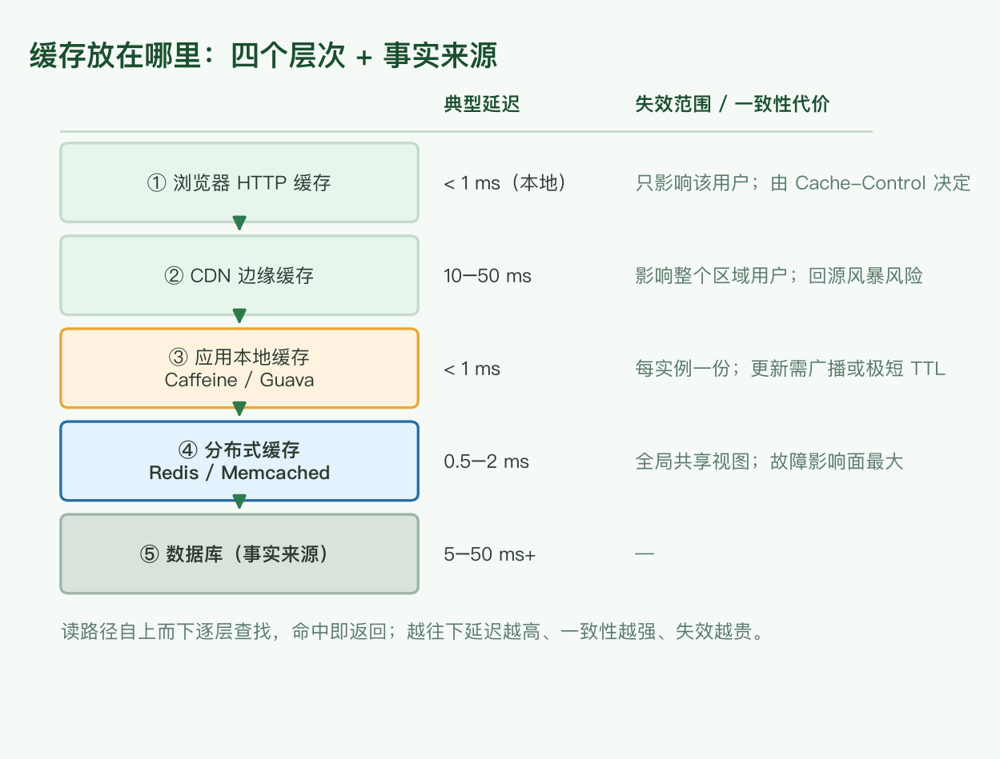
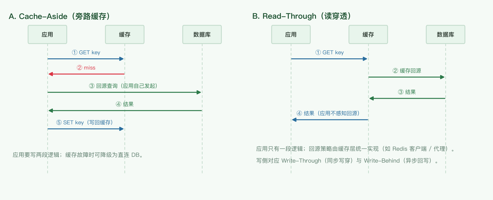

# 缓存与消息队列选型

组件选型三篇之一：本文覆盖**缓存**（放在哪、用什么、缓存什么、读写模式）与**消息队列**（选型标准、投递语义、容量估算）。存储选型见 [data-store-selection.md](./data-store-selection.md)，数据处理与分析栈见 [data-processing-and-olap.md](./data-processing-and-olap.md)。

## 1. 缓存放在哪里

缓存不是「加一层 Redis」，而是沿着请求链路逐层布置的四道闸门，外加作为事实来源的数据库。

| 位置 | 典型实现 | 典型延迟 | 失效范围 / 一致性代价 |
|---|---|---|---|
| ① 浏览器 | `Cache-Control` / `ETag` / `Service Worker` | < 1 ms（本地） | 只影响该用户；版本发布后的旧页面滞留 |
| ② CDN 边缘 | 各家 CDN / 自建边缘节点 | 10–50 ms | 影响整个区域用户；回源风暴风险 |
| ③ 应用本地 | Caffeine（原文写的 Guava Cache，见勘误） | < 1 ms | 每实例一份；更新需广播或极短 TTL |
| ④ 分布式 | Redis / Memcached | 0.5–2 ms | 全局共享视图；故障影响面最大 |
| ⑤ 数据库 | — | 5–50 ms+ | 事实来源，不做缓存语义 |

**越靠近用户**：延迟越低、命中成本越低，可见的一致性越弱、失效范围越小。
**越靠近数据库**：一致性越强、失效越彻底，但延迟高、故障影响面大。

## 2. 用什么做缓存

- **浏览器**：HTTP 缓存语义，靠 `Cache-Control: max-age`、`ETag` / `Last-Modified` 协商。
- **CDN**：边缘节点缓存静态资源；关键在回源策略与刷新接口。
- **应用本地**：Caffeine（推荐）/ Guava Cache；单机内存，需要处理多实例一致性问题。
- **分布式**：Redis（复杂数据结构 + 持久化）/ Memcached（纯 KV，多线程模型）。

## 3. 缓存什么

- **分开全量与增量**：全量数据缓存一次写入、长期有效；增量数据按更新频率决定 TTL。
- **按查询粒度设计 key**：key 太粗则命中率虚高但复用率低，key 太细则命中率低、内存放大。
- **区分冷热**：只缓存访问频次足够高的数据，否则只是把内存换成命中率更低的一层。

## 4. 本地缓存 vs 分布式缓存

| 维度 | 应用本地 | 分布式 |
|---|---|---|
| 延迟 | 纳秒 ~ 微秒级 | 0.5–2 ms |
| 容量 | 受单机堆内存限制 | 可独立扩缩 |
| 一致性 | 每实例一份，更新需广播 | 全局单视图 |
| 失效 | 只能 TTL 兜底或订阅广播 | 统一删除 |
| 故障影响 | 仅该实例 | 影响所有实例 |

**多级缓存**（本地 + 分布式 + DB）是常见组合：本地挡住最热的数据，分布式挡住中等热度的数据。代价是本地层的一致性——必须明确「允许多大窗口的脏读」，要么短 TTL、要么用发布订阅广播失效。

## 5. 缓存读写模式

| 模式 | 写侧行为 | 一致性 | 适用 |
|---|---|---|---|
| **Cache-Aside**（旁路） | 应用写 DB 后**删除**缓存 | 有窗口，需 TTL 兜底 | 最通用，业务可控 |
| **Read-Through** | 读时由缓存层负责回源 | 同 Cache-Aside | 应用逻辑简单，回源策略集中在缓存层 |
| **Write-Through** | 应用写缓存，缓存同步写 DB | 强（写两者都成功才算成功） | 写后立刻要读到 |
| **Write-Behind** | 应用只写缓存，缓存异步刷 DB | 弱，有丢数据风险 | 写吞吐优先 |

写侧的关键点：**更新缓存 vs 删除缓存**。删除更安全（避免并发写导致的旧值覆盖新值），代价是下一次读会 miss。

## 6. Redis vs Memcached

原文列出 5 点区别，其中两点表述有误，已就地修正：

1. **数据结构**：Redis 的 value 支持 List、Set、Hash、Sorted Set 等复杂结构（可当远程的 sorted list 用）；Memcached 只有 string / blob。
2. **持久化**：Redis 支持 RDB / AOF 持久化；Memcached 完全不持久化，重启即全丢。
3. ~~key 总在内存中，但 value 不一定在内存中~~ → **勘误**：Redis 的数据（key 与 value）都在内存中。原文描述的是 Redis 2.4 之前的 VM（虚拟内存/swapping）机制——把不常用的 value 换出到磁盘，2.4 起已废弃。因此**可用内存就是数据量上限**，超出后靠淘汰策略（`maxmemory-policy`）而非换页。（参见第 10 节勘误）
4. ~~Memcached 的 key 会过期，类似 LRU 淘汰~~ → **勘误**：TTL 过期 Redis 与 Memcached **都支持**；LRU 淘汰两者也都有（Memcached 的 slab LRU，Redis 的 `allkeys-lru` 等）。Memcached 真正的区别是**无持久化、无复杂数据结构、多线程模型**。
5. 原文「Redis 会利用磁盘存放 value，所以能存放大于机器内存的数据」建立在 VM 机制上，2.4 之后不再成立。Redis 的磁盘只用于持久化与 append-only 日志；真正突破单机内存的方案是 **Redis Cluster 分片**。

**分布式能力**：Redis 现在有标准方案（Redis Cluster 原生分片、Sentinel 高可用、或 Codis / Twemproxy 代理层分片）；Memcached 客户端侧一致性哈希分片。

## 7. 消息队列选型标准

1. **语言支持**：尽量选客户端语言覆盖广的（Kafka / RabbitMQ / Pulsar 均有主流语言客户端）。
2. **协议标准**：AMQP / STOMP / MQTT 等标准协议，还是私有协议。
3. **是否保序**：多数 MQ 只保证**单分区 / 单队列内**有序；注意应用层重试依然会引入乱序（重试的消息会排到队尾）。
4. **投递保证**：at-most-once / at-least-once / exactly-once（见第 8 节）。
5. **是否持久化**：能否落盘，落盘后吞吐退化多少。
6. **消费者挂掉重连后能否续读**：这与第 4 条相关但**不等价**——取决于 ack 时机与 offset 提交策略：手动提交 offset 的消费者重启后从上次提交点续读；自动提交或提前 ack 则会丢。
7. **可扩展性**：能否增加分区 / 节点线性扩容。
8. **延迟**：端到端延迟量级（Kafka 批量化后 ms 级，传统 AMQP 更低延迟但吞吐低）。
9. **竞争消费者（competing consumers）**：是否支持多个消费者并行消费同一队列——这其实是**特性**而非选型维度，但它决定了「消费者组」能否水平扩展。

## 8. 投递语义

| 语义 | 行为 | 代价 |
|---|---|---|
| At-most-once | 投递一次，可能丢 | 无重复，可能丢消息 |
| At-least-once | 失败重试，可能重复 | 不丢，但可能重复 |
| Exactly-once | 端到端不丢不重 | 分布式下只能通过「上游 at-least-once + 下游幂等」实现效果 |

「Exactly-Once 是效果而不是机制」的完整推导与幂等实现见 [idempotency.md](./idempotency.md)。

## 9. 选型清单与容量估算

### 缓存决策清单

1. 是否需要**跨实例一致**？否 → 应用本地（Caffeine）；是 → 分布式（Redis）。
2. 能接受**多大窗口的脏读**？决定 TTL 与失效方式（删除 / 广播）。
3. 数据**能否容忍丢失**？能 → 缓存可以承担部分存储职责；不能 → DB 必须是事实来源，缓存只做加速层。
4. 是否要缓存**复杂结构**（排行、集合运算）？是 → Redis 的 Sorted Set / Hash。

### 缓存内存估算

缓存 N 个条目、每条约 S 字节，加上 Redis 自身开销（字典、对象头、jemalloc 碎片，通常在 30%–50%）：

$$
M \approx N \times S \times (1 + o), \quad o \in [0.3,\ 0.5]
$$

已知 QPS $Q$ 与命中率 $h$，落到数据库的读放大为：

$$
\text{DB QPS} = Q \times (1 - h)
$$

所以「命中率从 95% 提到 99%」不是锦上添花：$Q = 100{,}000$ 时，DB 压力从 5000 QPS 降到 1000 QPS。

### 队列容量估算

分区数（Kafka 类）取吞吐需求与并行度需求的较大者：

$$
P = \max\left(\left\lceil \frac{T_{target}}{T_{partition}} \right\rceil,\ C_{consumers}\right)
$$

磁盘占用 = 写入速率 × 保留时长 × 副本数：

$$
D = R \times T_{retention} \times r
$$

例：写入 50 MB/s、保留 7 天、3 副本 → $50 \times 86400 \times 7 \times 3 \approx 90.7\ \text{TB}$。

## 10. 勘误与过时组件

| 原文说法 | 问题 | 现在的说法 |
|---|---|---|
| 「redis 的 value 不一定在内存中，此时会比较慢」 | 描述的是 Redis 2.4 前的 VM 机制 | 2.4 起废弃，数据全在内存 |
| 「memcache 的 key 是会过期的，类似 LRU 淘汰」 | 把过期与淘汰混为一谈，且 Redis 同样支持 | 两者都支持 TTL 与 LRU；Memcached 的差异是无持久化、无复杂结构 |
| 「redis 会利用磁盘存放一些 value，所以可以存放大于机器内存的数据」 | 建立在已废弃的 VM 机制上 | 突破单机内存靠 Redis Cluster 分片 |
| 「Guava」作为本地缓存 | Guava Cache 已停止演进 | Caffeine（Guava 作者重写，W-TinyLFU 淘汰算法，命中率更高） |
| 消费者重连能否续读「感觉是 4 的同一个问题」 | 与投递语义相关但不等价 | 取决于 ack 时机与 offset 提交策略 |

## 结论

- 缓存的第一个决定不是「用不用 Redis」，而是**放在哪一层**：越靠前延迟越低，越靠后一致性越强。
- 本地缓存与分布式缓存不是二选一，多级缓存要显式回答「能接受多大窗口的脏读」。
- Redis 与 Memcached 的分界已经很清楚：要数据结构、持久化、分布式分片 → Redis；只要最简单的 KV 且内存效率优先 → Memcached。
- 消息队列的选型核心是**投递语义 + 分区语义**：保证什么、重复多少、单分区内是否有序——这三条决定了业务侧需要多少幂等代码。
- 估算先于选型：缓存按「条目数 × 单条大小 × 1.4」估内存，队列按「吞吐需求 vs 单分区吞吐」定分区数。
