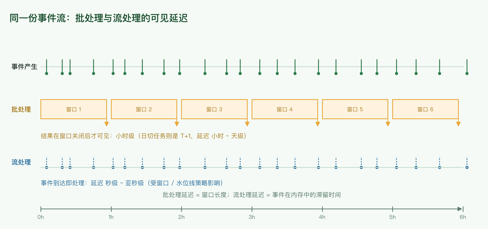
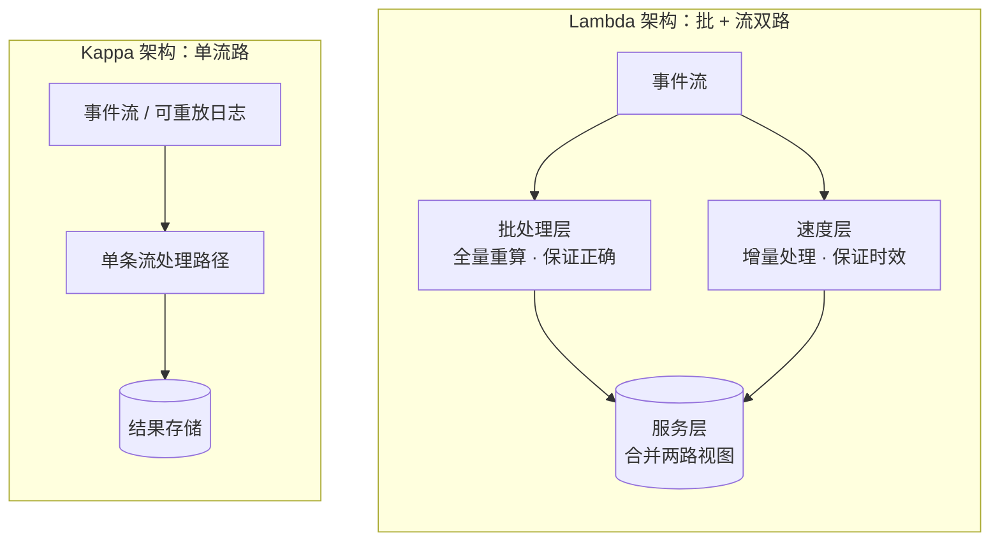
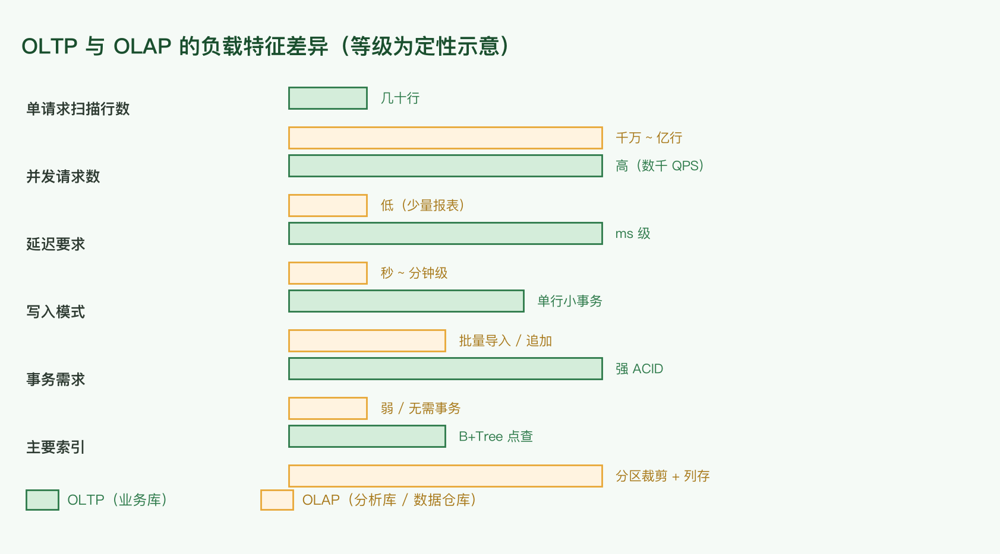
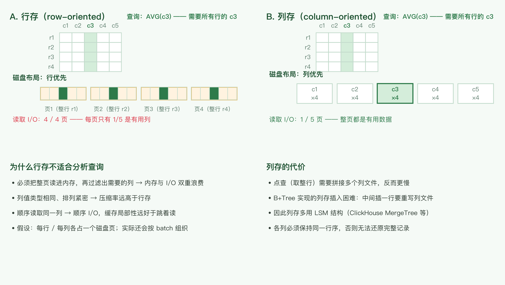
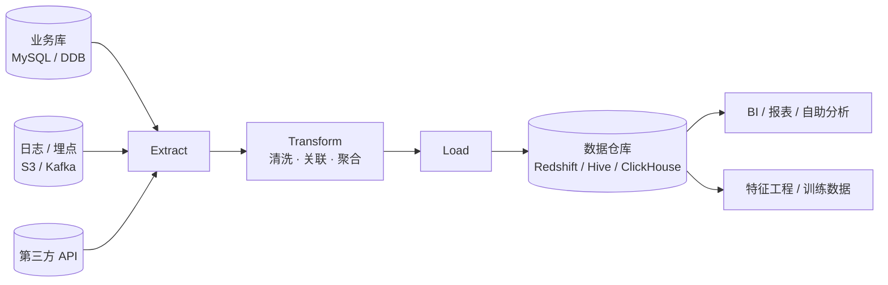

# 数据处理与 OLAP

组件选型三篇之三：数据怎么处理、分析型存储怎么选。缓存见 [caching-and-messaging.md](./caching-and-messaging.md)，存储选型见 [data-store-selection.md](./data-store-selection.md)。

## 1. 批处理 vs 流处理

这里的「流处理」指实时处理。

| | 批处理（Batch） | 流处理（Stream） |
|---|---|---|
| 触发方式 | 定时调度（日切 / 小时级） | 事件到达即触发 |
| 延迟 | 分钟 ~ 小时 ~ 天级 | 秒级 ~ 亚秒级 |
| 输入 | 有界数据集（文件、S3 前缀、表快照） | 无界事件流 |
| 正确性 | 可重跑、易对账 | 需水位线 / 窗口语义处理乱序 |
| 典型实现 | Hadoop、Spark | Flink、Kinesis + Lambda、（内部）Datapath（流式数据处理平台） |
| 内部例子 | （内部）Cradle（批量调度平台）、DataPipe Line（数据管道平台） | DDB Stream（表级变更流） |

**核心结论**：要用**不同的 data store + 不同的处理方式**（batch / stream）解决不同规模、不同实时性的问题。

- DynamoDB 不适合做 scan query，尤其是亿级数据量——这是设计约束，不是性能调优问题。
- 但同样亿级的数据，离线的 S3 + Spark 处理起来就很简单。

所以同一个业务里「在线点查走 DDB + 离线全量分析走 S3/Spark」是完全正常的组合，缺的只是把它们接起来的那条管道。

### Lambda 架构 vs Kappa 架构

原文提到「Kinesis + Lambda，Lambda 这种触发的方式可以构成一个流式处理」——这里要区分两个同名的 Lambda：

- **AWS Lambda**：一个函数计算服务，事件触发即可当流处理的执行单元。
- **Lambda 架构**（Nathan Marz）：批处理层 + 速度层 + 服务层，批层保证正确性、速度层保证实时性，代价是两套代码要维护同一份逻辑。
- **Kappa 架构**：只保留流处理一条路径，需要重算历史时重放日志。代价是重放成本与对日志保留时长的要求。

## 2. 存储引擎的两个类型：事务处理与分析处理

### 事务处理（OLTP）

平时的业务处理——更新数据库等，系统中的主要请求类型。访问模式通常是**返回一个或多个记录的所有字段并更新某些列**，或插入几行新记录。大多数与用户交互的应用都是这种模式。

### 分析处理（OLAP）

业务上很少用到，主要用于支撑业务决策，请求量少。访问模式是**读取巨量记录的某些字段，然后做聚合运算**（count / sum / average）。

### 共同点

两者都使用 SQL 接口。这也是很多选型错误的来源：SQL 一样，但底层数据组织方式必须不同。

## 3. 分析处理的解决方案：数据仓库

### 为什么需要专门的 data warehousing

1. 通常的 OLTP 直接与用户业务相互影响，而分析处理要读取海量记录；直接跑在 OLTP 上会影响线上性能。因此用专门的 data warehouse 来承担分析处理——通常通过 **ETL** 把关系数据库的数据导入数仓，所以数仓是**只读数据的副本**。
2. 由于业务库与数仓的数据访问方式不同，可以采用不同的底层优化技术。例如索引结构在数据仓库中不常见，而**基于列的存储**可以极大提升分析处理的效率。

### 基于列的存储（列式存储）

1. 在分析处理的应用中，很少出现 `SELECT *` 这样的需求。
2. 传统基于行的数据库，一行的不同属性放在相邻位置，相邻的行也放在磁盘上一起。
3. 由于数仓的访问特性（读取大量记录但只读某些列），行式存放不再合适：按行存储必须先读入所有这些行的所有列（占据大量内存）然后再过滤。列式存储把**所有记录的某一列放在一起**，省掉了这个过程。
4. 除此之外，同一列的数据类型一致、排列紧密，**很容易做压缩**。
5. 注意：列存储必须保证**每一列的行序一致**，否则无法还原一条完整记录。
6. 列存储也可以让某些列按序存放，但依然要保证各列对应同一行序——这样才能更好地支持压缩与 range query。
7. 基于 B+Tree 实现的列存储对写很不友好：在中间插入一行意味着重写整个列数据文件；基于 **LSM** 的实现没有这个问题。

### Materialized aggregates

某些聚合结果会被多个 query 复用。为了提升性能，可以把这些聚合结果物化——本质上就是写到磁盘上。

**原文观点**：OLTP 上一般不实现这个，因为一旦发生写，materialized view 需要重新计算，对 OLTP 的数据量来说性能不行。

**补充**：这个结论在「全量重算」的前提下成立，而现在的**增量物化视图**已经把这个代价降下来了——ClickHouse 的 materialized view 在写入时增量更新，PostgreSQL 也有 `pg_ivm` 这类扩展。因此「需要聚合视图」不再是 OLAP 专属的结论，关键仍是写入频率与查询频率的比值。

### Data cube

Data cube 是一种特殊的 materialized view：它按照某个维度做了聚合（例如「按天 × 按地区 × 按品类」的销量）。维度组合数 $2^n$ 会随维度数指数增长，所以实践上只物化被查询最多的那几组维度。

## 4. ETL 与数据仓库

**ETL** 是 Extract-Transform-Load 的缩写，描述将数据从来源端经过**抽取（extract）→ 转换（transform）→ 加载（load）**到目的端的过程。ETL 一词较常用在数据仓库，但其对象并不限于数据仓库。

这个工具做的更多是：把不同数据源的数据经过抽取 / 转换 / 加载，统一到满足同一数据格式的目的端。例如数据仓库需要把不同数据源汇集到一起，用于某种查询。

### 数据库与数据仓库的区别

前者是业务性数据库（读写都优化），后者是分析性数据库（数据仓库）。

**数据仓库也是一种结构体系，它不仅仅是具体的技术。** 例如拿 MySQL 这个数据库和 Apache Hive 这个数据仓库为例：Hive 事实上是一个很宏大的「体系结构」——它可以把元数据保存在 MySQL、Oracle 或 Derby 这些具体的数据库「技术」里；它在查询时把 SQL 转化成 MapReduce job（后来是 Tez / Spark 引擎），这里又用到了 MapReduce 计算模型这种「技术」。

实际上数据仓库也是很大的一块技术，包括 column-based database 等，因为其用途主要是分析任务，与业务性数据库不同。

| | 流行产品 |
|---|---|
| 数据库 | MySQL、Oracle、SQL Server |
| 数据仓库 | AWS Redshift、Greenplum、Hive |

## 5. 选型清单与容量估算

### 批 vs 流决策清单

1. **延迟要求是多少？** 分钟级以下 → 流；小时 / 天级 → 批。
2. **是否需要重算历史？** 需要且日志可重放 → 流（Kappa）；需要频繁全量重算 → 批。
3. **逻辑复杂度**：复杂的多表关联、迭代计算 → 批更省事；简单的过滤、聚合、告警 → 流。
4. **数据源是否天然是流？** 埋点、CDC、传感器 → 流优先；表快照、文件 → 批优先。
5. **能否接受两套代码？** 能 → Lambda 架构；不能 → Kappa 或纯批。

### 容量与成本估算

每日增量数据量（$r$ 为平均事件速率 /s，$s$ 为单事件字节数）：

$$
D_{day} = r \times 86400 \times s
$$

流处理的容量必须按峰值而非均值设计：

$$
r_{peak} = r_{avg} \times k, \quad k \approx 3\text{–}10
$$

列式存储的扫描成本正比于**读取的列占比**，这正是它快的原因：

$$
C_{scan} \propto D_{total} \times \frac{c_{used}}{c_{total}}
$$

例：100 列的表只读 5 列，扫描量降到 5%。行存做不到这一点——它必须把整行读进来。

存储成本 = 日增量 × 保留天数 × 单价，冷热分层（热数据在列存、冷数据在对象存储）能显著压低长期成本：

$$
C_{storage} = D_{day} \times N_{days} \times p
$$

## 6. 勘误与过时组件

| 原文说法 | 问题 | 现在的说法 |
|---|---|---|
| Cradle、DataPipe Line、Datapath、CSG | 内部组件名，外部读者无法理解 | 保留原名 + 类型注释（批量调度平台 / 数据管道平台 / 流式数据处理平台） |
| 「基于列的数据库」 | 措辞混淆了存储模型与产品 | 列式存储（column-oriented storage）；产品如 ClickHouse、Redshift、AnalyticDB |
| 「Lambda 这种触发的方式可以构成一个流式处理」 | Lambda 有歧义：AWS Lambda（函数服务）vs Lambda 架构 | 「函数触发的处理」用 AWS Lambda；「批 + 流双路」用 Lambda 架构（对应 Kappa 架构是单流路） |
| 「OLTP 上一般不实现 materialized view，因为要重新计算」 | 前提是全量重算 | 增量物化视图（ClickHouse MV、PG `pg_ivm`）已可用；判据仍是写入/查询频率比 |
| 「Hive 事实上就是一个很宏大的体系结构」 | 表述抽象 | 成立：Hive = 元数据存储（可复用 MySQL）+ SQL → 计算引擎翻译层，本身不是单一技术 |
| 「跟 hive 没有关系」用于区分 HBase | 结论正确但容易被忽略 | HBase 是宽列存储（Bigtable 系），Hive 是 Hadoop 上的数据仓库层；两者常有共同依赖（HDFS）但定位不同 |

## 结论

- **批与流不是替代关系**：同一份数据，在线点查、实时告警、离线全量分析本来就该用不同存储与不同处理方式。
- **列式存储是分析性能的根本原因**：只读需要的列 + 同列同类型便于压缩，这两点带来的是数量级的差异，而不是调优收益。
- **行列存的选择取决于访问模式**：点查多 → 行存（B+Tree）；扫描聚合多 → 列存（列式 + 分区裁剪）。
- **物化聚合的代价来自写**：全量重算不适合 OLTP，但增量物化视图把门槛降下来了，仍要看写入频率。
- **数仓是体系而非产品**：Hive 这类「数仓」本身由元数据存储、计算引擎、存储格式多层技术拼装而成。
