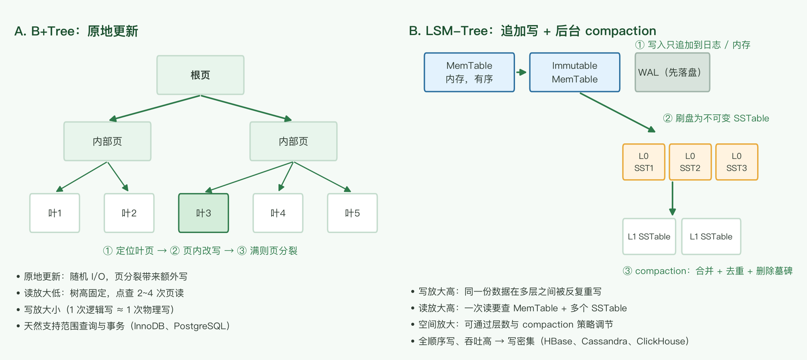

# 数据存储选型

组件选型三篇之二：数据库怎么选。缓存见 [caching-and-messaging.md](./caching-and-messaging.md)，分析栈与数仓见 [data-processing-and-olap.md](./data-processing-and-olap.md)。

## 1. 选型的九个考虑要点

1. **access pattern（读 + 写）**——这一条通常起决定作用：应用的功能性访问方式是刚性的，反向决定 DB。
   - **读形态**：主键 / 任意键值查询 → KV 库（DynamoDB、Redis）；range query → 有序存储（B+Tree 索引、DynamoDB sort key）；spatial query → 空间索引（Elasticsearch、PostGIS）；full scan / 分页遍历 → 列存 + 分区（ClickHouse）或离线批处理；full text search → Elasticsearch。
   - **写形态与更新粒度**：点写 vs 批量导入 vs 追加（append-only）；整行覆盖 vs 单字段更新 vs 追加——覆盖式适合 B+Tree，追加式天然契合 LSM / Kafka / 时序库；高频同 key 并发写需要版本号 / 乐观锁 / 最后写入者胜。
   - **读写比例**：读多写少 → 缓存解决；写多读少 → LSM 引擎（见 [lsm-vs-btree.png](./images/lsm-vs-btree.png) 与第 3.2 节宽列库）。
   - **热点与数据倾斜**：少数 key 承担绝大多数流量（排行榜、大 V、热门商品）时，分片键选错（按时间 / 固定前缀）会直接导致倾斜。
   - 不能只定性，还要给量级（QPS、热点 key、读写比数值），这是第 6 节容量估算的前提。
2. **数据量大吗？需要水平扩展吗？** 单机放不下（含索引、含预留增长）才谈分片。
3. **schema 固定吗，经常改变吗？** 结构化固定字段（关系库）vs 非结构化、每篇不同的字段（文档库）。
4. **性能要求？** 明确 tp50 / tp99 的目标，而不是「要快」。
5. **支持的 API**：insert / update、upsert（insert-or-update）、批量写、事务写、聚合与过滤。聚合需求强 → 列存。
6. **存储数据大小**：大对象（图片、XML 文档）通常以 **4 KB 为界**，因为 4 KB 是一个磁盘页大小——超过就意味着单条记录跨越多个页，读写放大。大对象 + range query 时还要考虑服务端做转换时的内存压力。
7. **一致性要求**：
   - 是否需要「读到自己写的最新值」？
   - 应用中的操作是否需要全局有序？
   两者之一为「是」，则对一致性有强要求。
8. **Durability**：写成功是否代表一定不丢？单副本 vs 多副本 vs 异步复制。
9. **graph store**：用于实体间特别复杂的关系。社交场景不只是「朋友关系」，还有「在同一家公司工作过的人」这类多跳查询——用关系模型表示需要为每种新查询建新表。

**三层模型**：access pattern 决定存储家族；事务 / 一致性 / durability 是硬约束、有否决权（一个否决项就能盖过家族选择，比如银行账本点写点读也不得不选关系库）；规模（数据量 / QPS）决定部署形态与引擎参数。三者不是线性重要性排序。

**反向决策的边界**：access pattern 会随产品演化（加报表、加搜索、加新查询），反向决策容易过拟合当下。关系库（schema + SQL + 索引）吸收未知查询的能力强于 KV / 文档库，NoSQL 一旦 access pattern 变了迁移成本更高。所以反向决策当下，但用「未来 query 会不会变」做压力测试；另有团队熟悉度、生态等软约束。

## 2. 关系数据库内部选型

1. **能否单机支持？** 先回答这个。单机 + 只读副本 + 缓存能覆盖绝大多数业务。
2. **是否需要 NewSQL？** 例如 TiDB、Spanner、CockroachDB。**自己分表并不是好方案**——分片键、跨片查询、在线扩容、分布式事务都要自己做，应该优先交给 NewSQL 或成熟的数据库中间件。
3. **是否有成熟的分片中间件？** ShardingSphere、Vitess 等，代价是引入一层代理与额外的运维复杂度。

## 3. 几类数据存储对比

### 3.1 关系数据库

**代表**：MySQL、PostgreSQL、Oracle

**优点**
- 有 schema，能很好地表达表中不同实体之间的关系
- SQL 能快速实现复杂查询（join、聚合、窗口函数）
- 支持事务（ACID）
- 对 many-to-many 的建模支持好

**缺点**
- 复杂 join 场景下读写性能相对较差
- 横向扩展不易——但已有 NewSQL（TiDB 等）补上这一块

### 3.2 NoSQL：非关系数据库的统称

**共同优点**：一般支持 automatic sharding、读写性能高得多。
**共同缺点**：支持的查询模式简单；复杂查询往往要自己实现；不支持或弱支持 schema。

| 类别 | 代表 | 定位与取舍 |
|---|---|---|
| **KV** | Redis、Memcached、DynamoDB | Redis 的 value 还支持 List / Set / Hash / Sorted Set 等复杂结构，不再只是 KV |
| **文档** | MongoDB | 适合「有 schema，但每篇文档结构不同」的数据（如文档协作类应用）。注意 schema-less 不等于没有数据形状约束，约束被搬到了应用层 |
| **图** | Neo4j | 社交等复杂图模型；多跳关系查询是它的主场 |
| **宽列 / 列族** | HBase、Cassandra | Bigtable 模型：rowkey 实时查询，条件 scan 与聚合满足分析需求。写密集型，读取性能一般；性能不如 Redis / Memcached，但在海量数据 + 持久化存储上强得多。分片与 MapReduce 分析比 MongoDB 简单。**注意与 Hive 无关**——Hive 是在 Hadoop 上提供数据仓库功能的另一套东西 |
| **分布式搜索** | Elasticsearch | 强大高效的字段搜索 / 过滤，支持大数据量，ES 也可以当作 data store 使用 |

宽列库与写密集场景通常基于 LSM-Tree：写入只追加到 WAL 与内存表，再异步刷盘合并，换来高写入吞吐，代价是读放大与写放大。

**B+Tree vs LSM：三种放大的取舍**（RUM 猜想——读放大、写放大、空间放大三者不可兼得）：

**三个放大的定义**（把「逻辑操作」折算成「物理代价」）：
- **读放大**：1 次逻辑读，实际要读多少物理块 / 文件（I/O 次数或字节）。B+Tree 点查只碰 2~3 层页；LSM 要查 memtable + 多层 SSTable，Bloom filter 只能减少、不能消除候选文件。
- **写放大**：应用写 1 字节，介质实际写多少字节（含 WAL、整页重写、compaction）。B+Tree 小改重写整页（16 KB 页改 100 字节 ≈ 160x）；LSM 追加写便宜，但 compaction 把同一数据反复重写多层。
- **空间放大**：物理占用 / 逻辑有效数据。B+Tree 受页填充率（~50–70%）限制；LSM 在 compaction 前保留多版本 + tombstone，compaction 跟不上时空间放大更高。

三者由 compaction 策略互相兑换：leveled compaction 层更有序 → 读放大降、写放大升；tiered compaction 少合并 → 写放大降、空间 / 读放大升。

| | B+Tree | LSM-Tree |
|---|---|---|
| 读放大 | 低（O(log N)，2~3 层） | 高（多层 SSTable，靠 Bloom filter 缓解） |
| 写放大 | 高（原地更新重写整页） | 低~中（追加写，代价转给 compaction） |
| 空间放大 | 中（页填充率 50–70%） | 中~高（多版本 + tombstone 等压缩） |
| 定位 | 读优化 | 写优化 |

机制差异：B+Tree 是**原地更新**（改一条 100 字节记录要重写整页）；LSM 是**追加写 + 后台 compaction**，没有真正的 update，只有「写新版本 + 打 tombstone」。

**业界采用**：
- 选 LSM（写多 / 追加 / 规模大）：Facebook LevelDB → RocksDB → MyRocks（把 LSM 装进 MySQL，报告相对 InnoDB 约 2 倍压缩、写放大显著下降）；Google LevelDB / Bigtable；Cassandra、HBase、InfluxDB 的 TSM；TiKV（关系库 TiDB 的存储层却是 LSM）；DynamoDB（点查便宜、scan 贵正源于此）。
- 选 B+Tree（读多 / 事务 / 二级索引多）：MySQL InnoDB、PostgreSQL、SQLite、Oracle、SQL Server。

**除读写比外的决策维度**：
1. **二级索引数量**——B+Tree 的护城河，见下。
2. **更新形态**：原地小改 → B+Tree；append / upsert → LSM。
3. **尾延迟**：LSM compaction 会造成写停顿与读尖峰，延迟敏感系统是硬伤。
4. **SSD 寿命**：写放大直接折算成擦写次数。
5. **压缩率**：SSTable 整块压缩通常优于页压缩。
6. **工作集是否进内存**：全进 RAM 则读放大差异被抹平，写放大成为唯一区分项，LSM 占优。

**二级索引数量为什么是分水岭**——索引不是免费的，多一个索引 = 多一份写成本 + 存储：
- B+Tree：二级索引是一棵指向主键的独立 B+Tree，多一个索引 = 多一次原地页写（InnoDB 用 change buffer 缓冲成顺序写），读仍是 O(log N)，所以能容忍 5、10、20 个索引。
- LSM：每个二级索引都是**一整套独立的 LSM 树**（自己的 memtable + SSTable + compaction），每次写进 N+1 棵树、写放大倍增，读还要付读放大。所以 Cassandra 弱化二级索引，靠**反范式 / 物化视图**（数据复制多份，一次写、单 key 读）替代——用写换索引。

### 3.3 NewSQL

把 NoSQL 的性能与可扩展性带回关系数据库：保留 SQL 与事务，用分布式共识协议做分片与副本。

### 3.4 多模型数据库

结合多种模型于一体。原文作者的观点是：**还不如 dual write 到不同类型的数据库**。

**补充**：dual write 自身有一致性问题（两次写之间崩溃会出现双写不一致），生产上通常需要 Outbox 表或 CDC 管道来保证最终一致；多模型库的价值在于**共享同一个事务边界**，代价是每个模型都不如专用库强。这条取舍要显式做，而不是默认 dual write 更简单。

### 3.5 OLAP

很多也是列式存储，但与传统认知不同，现代产品普遍支持 ad-hoc query。

- **ClickHouse**：列存 + 向量化执行 + MergeTree，单表聚合极快
- **HybridDB**（现已演进为 **AnalyticDB**，见第 7 节勘误）：
  - 任意维度智能组合索引，使用方无需单独自建索引
  - 百亿大表查询毫秒级响应
  - 兼容 MySQL BI 生态，完备 SQL 支持
  - 原文评价：当时已知的「任意维度组合过滤 + 百亿级数据量 + 毫秒级响应」的唯一选择

### 3.6 性能可预测性

**为什么重要**：平均值会撒谎——系统是被「尾部」打垮的，不是被「平均」。9 个请求 1ms + 1 个请求 1s，平均 ≈100ms 看着没问题，但那个 1s 的往往是下单 / 支付。尾延迟还会被链路放大：N 层服务每层 p99 独立，整条链路「至少一层踩尾」的概率是 $1-0.99^N$（N=10 ≈ 9.6%，N=100 ≈ 63%）。可预测性失效还会使 Little 定律里的 W 不可控，连接池被打爆、超时重试、级联雪崩。

**雪崩例子**：下单接口常态 p99=5ms、连接池 100；某天 LSM major compaction（或 InnoDB checkpoint）使单查飙到 2s → 连接被慢查询占满 → 排队 → 1s 超时 → 重试翻倍 → 连接池打满 → 服务雪崩。事后监控：平均延迟几乎没涨，p999 从 20ms 飙到 2s。

**什么情况下会发生可预测性问题**：
1. **后台任务与前台争抢**：LSM compaction、InnoDB checkpoint / 脏页刷盘、PostgreSQL autovacuum、备份 / 快照 / 索引重建——最常见的抖动源。
2. **运行时停顿**：JVM 系（Cassandra / HBase / ES / Kafka）的 Full GC；热点行锁竞争；长事务 / 大查询占住 buffer pool 与 IO。
3. **数据分布问题**：热点 key（排行榜 / 大 V / 热门商品）、分片键选错导致少数分片过载。
4. **容量逼近边界**：工作集 > RAM（随机读打盘）、连接数 / CPU / 磁盘接近饱和（排队延迟指数上升）、云盘 IOPS 限流 / noisy neighbor。
5. **流量突变**：缓存击穿 / 雪崩、冷启动（工作集未预热）、秒杀 / 热点事件突发流量。
6. **扩缩容与迁移**：分片 rebalance / 在线扩容时的数据搬迁影响在线流量。

**选型启发**：
1. 把「尾延迟可预测性（p99/p999 + 方差）」列为与吞吐、一致性同级的硬指标。
2. 延迟敏感路径选可预测引擎：在线 OLTP → B+Tree（无后台 compaction 大抖动）；必须用 LSM 时主动治理抖动（错峰 / 限流 compaction、监控 write stall、预留余量）。
3. 平均性能 ≠ 可预测性：B+Tree 平均写吞吐低但方差小，LSM 平均高但尾部抖——前者定吞吐上限，后者定 SLA。
4. 工作集进内存是治抖的通用手段：热数据全在 RAM，延迟曲线自然平滑。
5. 留余量 + 用尾部设阈值：别在接近 100% 利用率跑；超时 / 熔断 / 告警阈值基于 p99/p999 而非平均。
6. 监控盯分布不盯均值：看 p50/p99/p999 与延迟直方图。

**RDS vs KV 的可预测性**：同为磁盘持久化时，LSM 型 KV（RocksDB / Cassandra / DynamoDB）比 B+Tree 型 RDS 更严重——compaction（+ JVM GC）是 RDS 没有的、周期性、难以消除的硬抖动源；RDS 的抖动主要来自事务锁竞争，属于应用可规避的软问题。若 KV 指 Redis（内存），结论反过来：Redis 延迟最可预测，问题形态变成单线程阻塞。

## 4. 向量数据库

用于搜索某个向量的 k-nearest neighbors（k 近邻），即向量的 similarity 检索。

**为什么需要它**：机器学习中大量问题会把对象表示为低维向量——word embedding、图片 embedding、用户/物品 embedding。推荐系统等场景需要「找出与这个向量最相似的其他向量」，而传统数据库不支持这类查询（B+Tree 索引对高维距离函数无能为力，只能退化为全表扫描）。

**典型实现**：pgvector（PostgreSQL 扩展，事务与向量检索同库，运维成本最低）、Milvus / Qdrant / Weaviate（专用向量库，规模更大）、FAISS（库而非服务，适合离线批量检索）。

**索引与取舍**：HNSW（图索引，召回率高、内存占用大）、IVF-PQ（倒排 + 乘积量化，省内存、需接受精度损失）。检索系统要同时看四个指标：召回率、延迟、内存、更新代价。

## 5. 多存储组合：不要只用一种存储

原文最重要的结论：**应用设计中可以同时使用多个存储系统**，按各自擅长的查询模式分工。

- DynamoDB 后面接 Elasticsearch：DDB 做点查，ES 做多条件检索
- MySQL 后面接 Elasticsearch：同样的旁路索引模式
- 关系库 + Redis：热数据缓存
- 对象存储 + 数仓：冷数据离线分析（见 [data-processing-and-olap.md](./data-processing-and-olap.md)）

**代价**：多一份数据就多一份一致性责任——同步延迟、补偿任务、双写失败的处理。旁路索引的一致性方案（Outbox / CDC）见 [microservices-read-query.md](./microservices-read-query.md) 与 [geo-replication.md](./geo-replication.md)。

## 6. 选型清单与容量估算

### 决策清单

1. access pattern 的读形态是什么？（主键 / 范围 / 全文 / 空间 / 向量 / 聚合）
2. 单机能否承载？（数据量 + 索引 + 预留增长 vs 单机可用存储）
3. 需要跨行事务吗？需要 → 关系库或 NewSQL。
4. 需要多强的读一致性？（读己之写 / 全局有序）
5. 写入是点写 / 批量 / 追加？写密集或追加式 → LSM 系。
6. 能否接受第二份数据副本？能 → 旁路索引组合。

### 容量估算

估算的前提是先把 access pattern 量化——QPS、热点 key、读写比数值；形态对了但量级没给，公式无法代入。

存储总量（含索引开销与副本）：

$$
D = N \times S \times (1 + r_{idx}) \times r_{replica}
$$

$r_{idx}$ 为索引膨胀系数（通常 0.2–0.5），最坏情况（多列索引密集的表）可达 1 以上。

并发连接需求由 Little 定律给出：

$$
L = \lambda \times W
$$

即 并发数 = QPS × 平均响应时间。例如 2000 QPS × 20 ms = 40 个并发连接在途——这是连接池大小的下界，而连接池必须小于数据库的最大连接数。

单机可行性的判断依据是**工作集能否放进内存**：若热数据 $D_{hot} < \text{RAM}$，则 B+Tree 大部分命中的是内存页，磁盘只承担顺序写；若 $D_{hot} > \text{RAM}$，随机读会直接打到磁盘，tp99 会显著劣化。

## 7. 勘误与过时组件

| 原文说法 | 问题 | 现在的说法 |
|---|---|---|
| 「HBase 作为文档型 NoSQL」 | HBase 不是文档型，是宽列/列族（wide-column）存储 | 宽列存储：rowkey 排序 + 列族；文档型是 MongoDB 那一类 |
| 「动态添加列，要存储列的多个版本，可能很多列为空」 | 表述含糊，易误解为大量空值占空间 | 列族 + 多版本是 Bigtable 模型；单元格稀疏存储，**缺失的列不占空间** |
| 「ES 的数据是准实时更新」 | 描述不准：ES 不是「更新慢」而是「写入后可见有延迟」 | 默认 `refresh_interval=1s` 才可被搜索；需要立刻可见可用 `?refresh=wait_for` |
| 「HybridDB」 | 产品已演进 | AnalyticDB（MySQL 版 / PostgreSQL 版） |
| 「多模型数据库还不如 dual write」 | 结论片面 | dual write 有一致性问题（需 Outbox / CDC）；多模型库的价值是共享事务边界 |
| 「自己分表这种方法并不好」 | 结论仍成立，但生态已变化 | 优先 NewSQL（TiDB / Spanner）；或成熟中间件 ShardingSphere / Vitess |
| 「leveldb 写性能很强」 | 作为库已基本被取代 | 演进为 RocksDB，并被 TiKV、MyRocks、CockroachDB 等广泛使用 |

## 结论

- **access pattern 先于产品**：先写清楚读（主键查、范围扫、全文检索、空间查询、向量相似度）+ 写（点写 / 批量 / 追加 / 更新粒度）+ 读写比与热点，再谈用哪个库；但 access pattern 会演化，别过拟合当下。
- **先问「单机能不能扛」**，再谈分片；能单机 + 只读副本就不要自研分表。
- **一致性、durability、读写比**是三个必须显式回答的问题，它们直接决定引擎类型（B+Tree vs LSM）与副本策略。
- **不要只选一种存储**：多存储组合是常态，代价是多一份一致性责任，必须有同步与补偿方案。
- 估算用两个公式：容量 $D = N \times S \times (1 + r_{idx}) \times r_{replica}$，并发 $L = \lambda W$。
